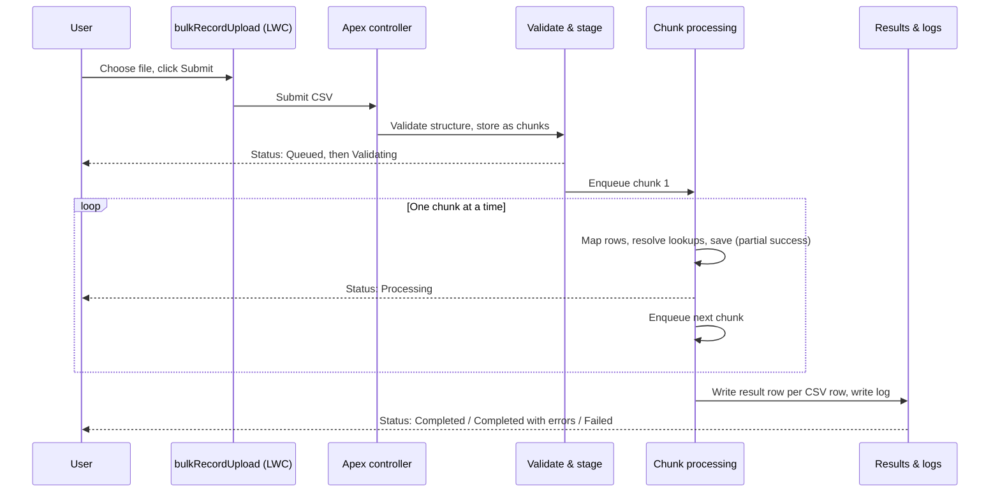

# Architecture

> [!NOTE]
> On this page, trace what actually happens between a user clicking Submit and the result file being ready, stage by stage.

## Scope

This page is for an Apex developer who is new to this specific framework — general Salesforce and Apex knowledge is assumed, but nothing about this package's internal classes is. If you're looking for where to plug in your own code, skip to [Write and register an extension](custom-handler.md) instead; this page explains the pipeline your extension runs inside of.

## The pipeline, end to end

A text walkthrough of the same stages, with the class that owns each one:

1. **Configuration and access.** Before anything runs, the process configuration (which object, which columns, who's allowed to run it) is resolved into a compact, cached snapshot covering at most 100 fields — never the whole object — plus what the current user is specifically allowed to do. This snapshot is what every later stage checks against, so access can't drift partway through an upload. `BulkRecordUploadProjectionService` builds it; `BulkRecordUploadAccessPolicy` is the access check.
2. **Validation and staging.** The uploaded CSV is checked against the limits in [Product limits](../admin/limits.md) (size, row count, column count), stored as a Salesforce File, and split into ordered chunks of rows — a chunk is just a bounded slice of the file, sized per the process's **Rows per Batch** setting. `BulkRecordUploadRequestService` and `BulkRecordUploadStagingService` own this stage.
3. **Chunk processing.** Chunks run one at a time, in order, using whichever mechanism fits the upload's size: a single small upload (one chunk) runs as one Queueable job; a bigger upload runs as Batch Apex, processing exactly one chunk per transaction. Using Batch Apex here — rather than chaining Queueable jobs — avoids the platform's limit on how many Queueable jobs can chain together, so a large upload isn't capped by that unrelated limit. Each chunk: maps CSV values onto the target object's fields (`BulkRecordUploadRecordMapper`), resolves any existing records it needs to merge into or match against in one bounded query (`BulkRecordUploadRecordResolver`), and saves with partial success — so one bad row in a chunk doesn't fail the other good rows in the same chunk (`BulkRecordUploadPersistenceGateway`).
4. **Extension points, if configured.** If the process has a registered extension class, it runs `beforeMap` (to adjust a row before it's mapped) and `afterProcess` (after a chunk is saved, seeing only the safe result — never the raw CSV). See [Write and register an extension](custom-handler.md) for the full contract.
5. **Results and logging.** Once every chunk finishes, one result row per original CSV row is written to the results file (`BulkRecordUploadResultWriter`), and a safe summary of what happened is logged (`BulkRecordUploadLogService`) — the log never contains raw CSV content or field values, only lifecycle facts like row counts and timing.
6. **Retention.** After the process's configured retention period, `BulkRecordUploadRetentionJob` cleans up the upload's own stored state. It never deletes a Salesforce File that something else still links to.

## How a user reaches an upload process

There's one exposed component, `bulkRecordUpload`. An admin places it and points it at one **Upload Bundle** (see [Configure an upload process](../admin/configure-upload-process.md) for how bundles work). At runtime, Apex resolves only the active processes assigned to that bundle — if there's exactly one, the component skips straight to it; if there's more than one, it shows a picker.

On a record page, App Builder's bundle picker only offers bundles that actually contain a process compatible with that page's object, and defaults to the one compatible bundle when there's only one choice. Whichever bundle is picked in App Builder is a configuration convenience, not a security boundary — Apex re-validates the resolved process through the same access checks used everywhere else on every request, so nothing about the App Builder wiring can be used to see or run a process the current user isn't otherwise allowed to.

## Limitations

- Extensions (both the row-extension seam and custom merge strategies) are the supported subscriber-written Apex entry points. The operation (Insert/Update/Upsert/Delete) and the built-in save path remain fixed so extensions do not replace the framework's persistence and permission checks. See [Custom handlers](custom-handler.md) for the extension contract.
- The pipeline processes chunks strictly in order, one at a time — it does not parallelize chunk processing within one upload.

## Related

Read [Cache design](cache-design.md), [Custom handlers](custom-handler.md), and the [product contract](../reference/product-contract.md).
