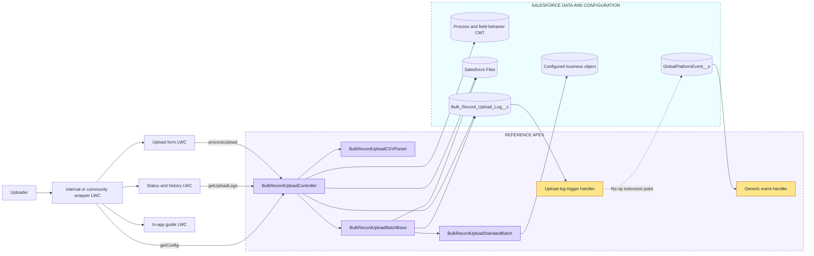

# Observed reference architecture

> [!NOTE]
> On this page, see the reference implementation boundaries observed in Apex, Lightning Web Components, metadata, and Salesforce Files before the project defines its replacement architecture.

## Runtime landscape



```text
Uploader
   |
   v
Wrapper LWC ---> Upload form ---> Controller ---> CSV parser
     |                                 |  |  |
     +-------> Status/history          |  |  +--> Salesforce Files
     +-------> In-app guide            |  +-----> Upload log
                                       +--------> Configuration CMT
                                                    |
Controller ---> Batch base ---> Standard handler ---> Business records
                    |  |
                    |  +--> Results file
                    +-----> Upload-log status
                               |
                               +--> No-op integration/event extension points
```

The diagram records responsibilities, not an approved target design. The controller combines configuration, authorization checks, file persistence, log persistence, sharing, handler dispatch, and history queries. The batch base combines orchestration, conversion, field behavior, DML, result generation, files, and logging and exceeds the project's 500-line limit.

## Evidence

- `research/bulkRecordUpload/force-app/main/default/classes/BulkRecordUploadController.cls`: `getConfig`, `processUpload`, and `getUploadLogs`.
- `research/bulkRecordUpload/force-app/main/default/classes/BulkRecordUploadBatchBase.cls`: batch lifecycle, field behavior, partial DML, Files, and log updates.
- `research/bulkRecordUpload/force-app/main/default/classes/BulkRecordUploadStandardBatch.cls`: dynamic object resolution and generic DML record construction.
- `research/bulkRecordUpload/force-app/main/default/lwc/`: wrapper, form, status, guide, and utility components.
- `research/bulkRecordUpload/force-app/main/default/objects/` and `customMetadata/`: configuration, upload log, event, and example/test records.

## Related

- [Observed data flow and threat boundaries](reference-data-flow-and-threat-boundaries.md)
- [Step 1 evidence summary](README.md)
