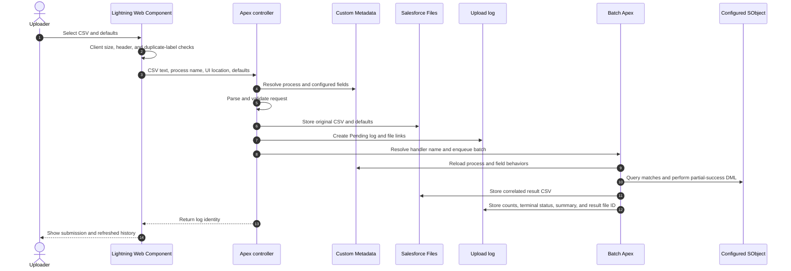

# Observed data flow and threat boundaries

> [!NOTE]
> On this page, trace untrusted CSV and administrator configuration through the reference runtime and identify the boundaries the replacement must secure.

## Upload sequence



```text
[Untrusted CSV/defaults]
          |
          v
  [Browser validation] -- not an authorization boundary
          |
          v
  [Apex controller] <---- [Administrator-authored CMT identifiers]
      |       |                         |
      |       +--> [Files and log]      +--> object, field, handler names
      v
  [Async batch]
      |
      +--> [Business-data query and partial DML]
      +--> [Result CSV, error summary, and operational history]
```

## Threat boundaries observed

| Boundary                 | Untrusted or sensitive input                                        | Reference concern                                                              | Required replacement control                                                                    |
| ------------------------ | ------------------------------------------------------------------- | ------------------------------------------------------------------------------ | ----------------------------------------------------------------------------------------------- |
| Browser to Apex          | CSV contents, file name, defaults, component location, process name | Client validation can be bypassed                                              | Repeat validation and authorization server-side; bound request sizes                            |
| Configuration to runtime | Object, field, Custom Permission, handler, and group identifiers    | Text values influence describe, dynamic SOQL, class resolution, and sharing    | Resolve through trusted registries and compact Schema projections                               |
| Apex to business data    | Converted field values and match keys                               | Dynamic query and DML cross CRUD, FLS, sharing, and uniqueness boundaries      | User-mode query/DML, explicit operation authorization, safe binding, partial-result correlation |
| Apex to Files            | Original CSV, defaults, and results                                 | Files can contain sensitive business data and formula-like cells               | Explicit ownership, link visibility, retention, export neutralization, and access tests         |
| Apex to logs/history     | File names, locations, status, counts, row errors                   | History can disclose activity or DML details across users                      | Least-privilege sharing, redacted errors, bounded pagination, and archive/retention rules       |
| Status to integration    | Broad platform-event fields and placeholder handlers                | Event metadata exists without a supported consumer or minimal payload contract | Remove from core until a versioned optional integration is approved                             |

## Assumptions and limitations

- The sequence is derived from reference source and tests; it was not verified in an org during this snapshot.
- Browser checks improve feedback but do not establish security.
- The generic platform-event path is shown as a threat boundary, not as supported behavior.

## Related

- [Observed reference architecture](reference-architecture.md)
- [Deferred integrations](../../../specs/artifacts/deferred-integrations.md)
