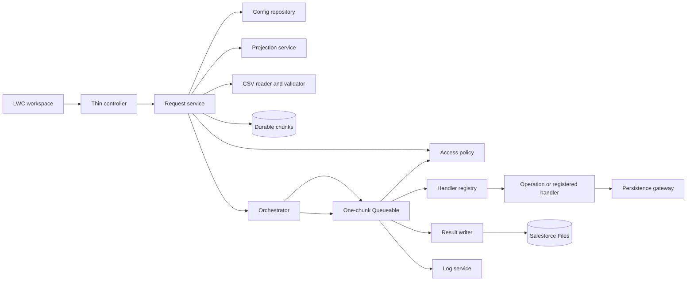

# Step 4 architecture and cache design evidence

> [!NOTE]
> On this page, trace the approved runtime architecture, chunk lifecycle, cache behavior, and measurable scale tests before Apex implementation begins.

## Architecture



```text
LWC -> controller -> request service -> config/access/projection/CSV
                                      -> durable chunks -> orchestrator
                                                            |
                                                            v
                                               one-chunk Queueable
                                               -> access recheck
                                               -> registry/strategy
                                               -> user-mode DML
                                               -> result fragment/log
                                               -> next chunk or finalize
```

## Required path tests

- Happy: every chunk succeeds, ordered results join, staging cleans up, status is `COMPLETED`.
- Partial failure: failed rows keep physical correlation and other rows commit; status is `COMPLETED_WITH_ERRORS`.
- Fatal: configuration/access/staging corruption stops further enqueue, preserves safe diagnostics, and reaches `FAILED`.
- Retry: a new linked upload uses a new idempotency key and does not mutate the prior result.
- Cancellation: version 1 rejects cancellation as unsupported without changing job state.

## Scale and cache fixtures

| Fixture                    | Measurable pass condition                                                                                                          |
| -------------------------- | ---------------------------------------------------------------------------------------------------------------------------------- |
| Synthetic 800-field object | Configure 12 fields; projection/DTO/SOQL/results contain only those fields plus minimal IDs and never serialize all 800            |
| Maximum input              | 5,000 rows produce at most 200 25-row chunks, or 25 200-row chunks, with stable row order and no stateful whole-file serialization |
| Cache disabled             | Functional projection equals warm-cache projection byte-for-byte after canonical serialization                                     |
| Forced eviction/corruption | Rebuild succeeds, returns the same projection, and records fallback metrics without sensitive data                                 |
| Extension handler          | Add one registry implementation without editing controller, parser, gateway, or unrelated strategies                               |

Executable results belong to Steps 6 and 8. This page approves the fixtures and thresholds only.

## Class-size review

Every planned class has one responsibility and a projection below the 450-line warning threshold; no projected class exceeds the 500-line hard limit. The component table and cache contract are authoritative in [ADR-0005](../../../specs/decisions/ADR-0005-runtime-and-cache-architecture.md).

## Related

- [Step 4 specification](../../../specs/04-architecture-and-cache-design.md)
